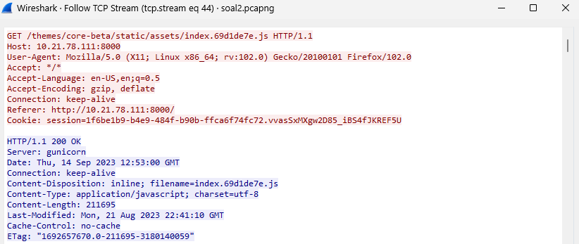
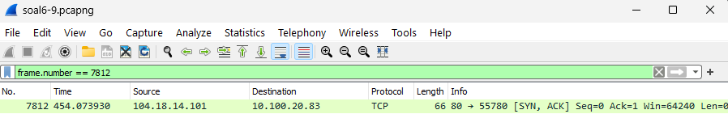
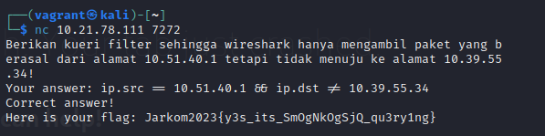

# Jarkom-Modul-1-D22-2023

## Group Member

| NRP        | Name                          |
| ---------- | ----------------------------- |
| 5025211015 | Muhammad Daffa Ashdaqfillah   |
| 5025211016 | Thomas Juan Mahardika Suryono |

## Table of Contents

- [Soal 1](#soal-1)
- [Soal 2](#soal-2)
- [Soal 3](#soal-3)
- [Soal 4](#soal-4)
- [Soal 5](#soal-5)
- [Soal 6](#soal-6)
- [Soal 7](#soal-7)
- [Soal 8](#soal-8)
- [Soal 9](#soal-9)
- [Soal 10](#soal-10)
- [Kendala Pengerjaan](#kendala-pengerjaan)

## Soal 1

### Pertanyaan

User melakukan berbagai aktivitas dengan menggunakan protokol FTP. Salah satunya adalah mengunggah suatu file.

- Berapakah sequence number (raw) pada packet yang menunjukkan aktivitas tersebut?
- Berapakah acknowledge number (raw) pada packet yang menunjukkan aktivitas tersebut?
- Berapakah sequence number (raw) pada packet yang menunjukkan response dari aktivitas tersebut?
- Berapakah acknowledge number (raw) pada packet yang menunjukkan response dari aktivitas tersebut?

### Penyelesaian
1. Untuk display filter dengan protokol FTP dan mengunggah file, dapat dicari dengan filter berikut  ‘ftp.request.command == STOR’ sehingga akan menampilkan hasil pengunggahan file GrabThePhiser.zip

2. Setelah itu buka info packet pada bagian TCP untuk mendapatkan Sequence Number dan Acknowledgment Number 

3. Untuk Response dapat dengan follow -> TCP Stream, lalu buka packet yang dibawahnya STOR dengan keterangan ‘Response’
4. Setelah itu buka info pada TCP untuk mendapatkan Sequence Number dan Acknowledgment Number

### Screenshot Validation

## Soal 2

### Pertanyaan

Sebutkan web server yang digunakan pada portal praktikum Jaringan Komputer!

### Penyelesaian
1. Filtering menggunakan ip Portal Jarkom dengan sintaks ‘http.host contains "10.21.78.111"’ untuk mendapatkan packet yang mengandung ip tersebut

2. Setelah Klik kanan untuk TCP stream dan akan mendapatkan info server yang digunakan Portal Jarkom

### Screenshot Validation

## Soal 3

### Pertanyaan

Dapin sedang belajar analisis jaringan. Bantulah Dapin untuk mengerjakan soal berikut:

- Berapa banyak paket yang tercapture dengan IP source maupun destination address adalah 239.255.255.250 dengan port 3702?
- Protokol layer transport apa yang digunakan?

### Penyelesaian

### Screenshot Validation

## Soal 4

### Pertanyaan

Berapa nilai checksum yang didapat dari header pada paket nomor 130?

### Penyelesaian
1. Filter untuk mendapatkan packet no 130 ‘frame.number == 130’

2. Buka detail packet, lalu lihat info pada User Datagram Protokol untuk melihat nilai Checksum

### Screenshot Validation

## Soal 5

### Pertanyaan

Elshe menemukan suatu file packet capture yang menarik. Bantulah Elshe untuk menganalisis file packet capture tersebut.

- Berapa banyak packet yang berhasil di capture dari file pcap tersebut?
- Port berapakah pada server yang digunakan untuk service SMTP?
- Dari semua alamat IP yang tercapture, IP berapakah yang merupakan public IP?

### Penyelesaian
Mendapatkan Kunci ZipFile untuk mengakses kunci NetCat
1. Display filter menggunakan sintaks ‘frame contains "zip"’

2. Lalu pada packet yang tersisa, Follow ->TCP Stream
3. Akan ada password dengan enskripsi base64, sehingga harus di decode ulang, saya menggunakan web base64 converter untuk mendapatkan password

4. Setelah mendapatkan password, buka file zip dan akan mendapatkan perintah nc

Mendapatkan Jawaban dari Soal :
1. Untuk melihat banyaknya packet yg dicapture dapat dilihat di pojok bawah kanan wireshark

2. Untuk melihat port SMTP dapat menggunakan display filter ‘SMTP’
3. Lalu lihat detail packet SMTP untuk melihat port servernya adalah 25

4. IP Public yang tercapture adalah 
74.53.140.153 karena IP lainnya merupakan IP Private dengan awalan address 192. atau 10.

### Screenshot Validation

## Soal 6

### Pertanyaan

Seorang anak bernama Udin Berteman dengan SlameT yang merupakan seorang penggemar film detektif. sebagai teman yang baik, Ia selalu mengajak slamet untuk bermain valoranT bersama. suatu malam, terjadi sebuah hal yang tak terdUga. ketika udin mereka membuka game tersebut, laptop udin menunjukkan sebuah field text dan Sebuah kode Invalid bertuliskan "server SOURCE ADDRESS 7812 is invalid". ketika ditelusuri di google, hasil pencarian hanya menampilkan a1 e5 u21. jiwa detektif slamet pun bergejolak. bantulah udin dan slamet untuk menemukan solusi kode error tersebut.

### Penyelesaian
1. Filter packet untuk mendapatkan packet number 7812 ‘frame.number == 7812’
2. Dari packet number 7182, didapatkan IP scr adalah '104.18.14.101'

3. Lalu dari IP tersebut, karena jawaban terdiri dari 6 huruf dan rentang angka 1-8 (didapatkan dari hint), maka IP tersebut di pecah menjadi '10-4-18-14-10-1'
4. Setelah itu decode menggunakan code chiper a1z26, sehingga didapatkan jawaban 'JDRNJA'

### Screenshot Validation

## Soal 7

### Pertanyaan

Berapa jumlah packet yang menuju IP 184.87.193.88?

### Penyelesaian
1. Melakukan filtering dengan sintaks ‘ip.dst == 184.87.193.88’
2. Jumlah packet yang dikirimkan terdapat di pojok bawah wireshark yang didisplay yaitu 6 packet

### Screenshot Validation

## Soal 8

### Pertanyaan

Berikan kueri filter sehingga wireshark hanya mengambil semua protokol paket yang menuju port 80! (Jika terdapat lebih dari 1 port, maka urutkan sesuai dengan abjad)

### Penyelesaian
1. Sintaks pada display filter ‘tcp.dstport == 80 || udp.dstport == 80’

### Screenshot Validation

Soal 9

### Pertanyaan

Berikan kueri filter sehingga wireshark hanya mengambil paket yang berasal dari alamat 10.51.40.1 tetapi tidak menuju ke alamat 10.39.55.34!

### Penyelesaian
1. Sintaks pada display filter ‘ip.src == 10.51.40.1 && ip.dst != 10.39.55.34’

### Screenshot Validation

## Soal 10

### Pertanyaan

Sebutkan kredensial yang benar ketika user mencoba login menggunakan Telnet

### Penyelesaian
1. Filter packet menggunakan ‘telnet’
2. Lakukan TCP Stream pada packet dengan protokol telnet
3. Lalu cari packet yang berisi kredensial login dan password yang dalam TCP Stream berisi juga data yang menandakan successful login (karena yang palsu tidak akan menampilkan data tersebut)

### Screenshot Validation

## Kendala Pengerjaan

- halo
